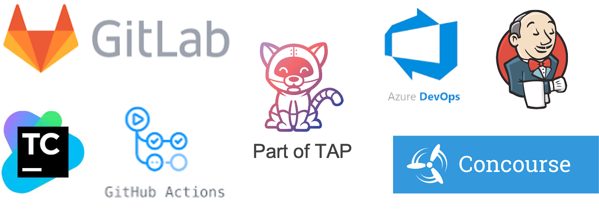

To handle the more complex deployment and operations of modern applications, there is a need for a culture change towards **DevSecOps**, a buzzword for improved collaboration between developers, security, and operations teams.
This collaboration should be **supported by automated processes**, like a self-service for developers to get access to the tools they need.

The automated process of testing applications and deploying them into production is called **Continuous Integration** and **Continuous Delivery** (CI/CD). 

The CI/CD tools universe is always in flux, but most of the solutions pose the same challenges.  

#### Challenges of most of the current CI/CD Tools
- They use an **orchestration model** where the orchestrator executes, monitors, and manages each of the steps of the path to production **synchronously**. If for example a path to production has a vulnerability scanning step, and a new CVE should arise, the only way to scan the code for it would be to trigger the orchestrator to initiate the scanning step or a new run through the supply chain.
- **Different path to production for each of the applications**. Even if all the pipelines are based on one template, it's hard to update all of them if the template changes.
- **No Separation of concerns** between the users and authors of the pipeline.
- The **developer experience is lacking**.

#### Introducing Cartographer - A Supply Chain Choreographer for Kubernetes


VMware Tanzu Application Platform uses the open-source Cartographer that allows developers to focus on delivering value to their users and provides operators the assurance that all code in production has passed through all the steps of a pre-approved path to production.

```dashboard:open-url
url: https://cartographer.sh
```

##### Design and Philosophy

Cartographer allows operators via the **Supply Chain** abstraction to define all of the steps that an application must go through in a path to production like container image creation or CVE scanning.

Because steps of the path to production are rarely synchronous, **Cartographer uses the choreography instead of orchestration model**, where each step of the path to production and the tool required for that **step knows nothing about the next step**. It is **responsible for receiving a signal that it must perform some work, completing it, and signaling that it has finished**. In the same case as above, with a pipeline that has a vulnerability scanner, if there is a new CVE, the vulnerability scanner would know about it and trigger a new scan. When the scan is complete, the vulnerability scanner will send a message indicating that scanning is complete.

###### Reusable CI/CD
By design, **a supply chain can be used by many workloads of a specific type**, like any web application. This allows an operator to specify the steps in the path to production a single time and for developers to specify their applications independently but for each to use the same path to production.


To enable app operators to consistently apply runtime configurations to fleets of workloads of a specific type implemented in different technologies, **Cartographer Conventions** is another component of TAP that is not yet available as OSS. 
```dashboard:open-url
url: https://docs.vmware.com/en/VMware-Tanzu-Application-Platform/1.5/tap/cartographer-conventions-about.html
```

###### Kubernetes Resource Interoperability
With Cartographer, it's possible to choreograph both Kubernetes and non-Kubernetes resources within the same supply chain via **integrations to existing CI/CD tools** like in our case **Tekton** or Jenkins.
```dashboard:open-url
url: https://tekton.dev
```

###### Separation of Concerns
While the supply chain is operator facing, Cartographer also provides an **interface for developers** called **Workload**. Workloads allow developers to create application specifications such as the location of their repository, environment variables, and service claims.

As this workshop is focused on the operator experience, a Workload is already applied to the namespace created for this workshop session. 
Let's have closer look at how a Workload allows developers to pass information about an application to be delivered through the supply chain.
